# SharePoint Online Intranet & Power Automate Workflows


---

## The Story

Imagine a growing company called **CorpLab GmbH** where employees struggle to find documents, share files, and communicate across departments. There is no central place to access company policies, no automated approval process for file submissions, and no system to welcome new employees automatically.

The IT team decided it was time to build a **modern digital workplace**. The goal: design and deploy a complete **SharePoint Online intranet** with a proper hub architecture, three department sites, document libraries, and group-based permission management using Microsoft Entra ID — then automate key business processes using **Power Automate**.

This is the story of how that digital workplace was planned, built, and proven to work — step by step.

---

## Architecture

```
CorpLab GmbH Hub Site (Hub Site — CorpLab Intranet)
│
├── IT Department Site (/sites/ITDepartment)
│   └── Policies & Procedures (Document Library)
│       ├── IT_Project_Plan.docx
│       ├── IT_Security_Policy.docx
│       └── Network_Procedures.docx
│
├── HR Department Site (/sites/HRDepartment)
│   └── Policies & Procedures (Document Library)
│       ├── Employee_Handbook.docx
│       ├── HR_Onboarding_Procedures.docx
│       └── HR_Recruitment_Policy.docx
│
├── Finance Department Site (/sites/FinanceDepartment)
│   └── Policies & Procedures (Document Library)
│       ├── Expense_Procedures.docx
│       ├── Finance_Budget_Policy.docx
│       └── Finance_Report_2026.docx
│
└── Power Automate Workflows
    ├── Flow 1: External Sharing Alert and Approval
    │   SharePoint trigger → Approval request → Condition → Email notification
    └── Flow 2: New Employee Welcome Email
        Outlook trigger → Automated welcome email
```

---

## Technologies Used

| Technology | Purpose |
|---|---|
| Microsoft SharePoint Online | Intranet hub site and three department sites |
| SharePoint Admin Center | Site creation, hub registration, site management |
| Microsoft Entra ID | Security group-based permission management |
| Microsoft Power Automate | Business process automation with cloud flows |
| Office 365 Outlook | Email approval notifications and welcome emails |
| Microsoft 365 Admin Center (CorpLab041) | Tenant administration |

---

## Phase 1 — Building the SharePoint Intranet

Every enterprise intranet starts with proper planning. Before creating any department site, a central hub site was needed to connect everything together and give the intranet a unified identity.

### Step 1 — Accessing SharePoint Admin Center

The SharePoint Admin Center was accessed from the Microsoft 365 Admin Center. This is the central management console for all SharePoint Online sites across the CorpLab041 tenant. At this point, the Active sites page showed only the default Communication site — a blank canvas ready for the intranet to be built.

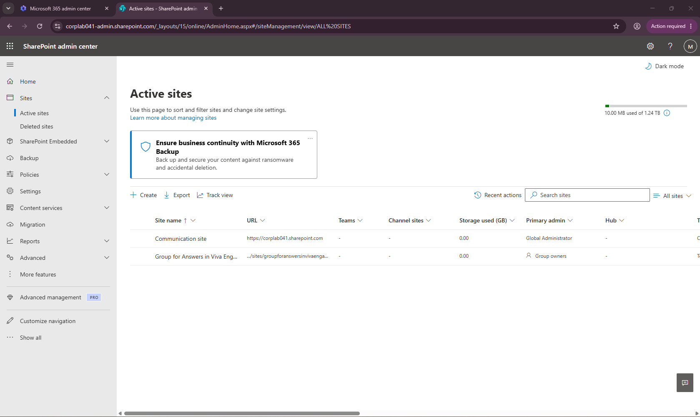

*SharePoint Admin Center showing the Active sites page for the CorpLab041 tenant — ready for the intranet build to begin.*

---

### Step 2 — Creating the CorpLab Intranet Hub Site

The foundation of any enterprise intranet is a **Hub Site**. A Hub Site connects all department sites together under one roof — providing shared navigation, consistent branding, and centralised search across all connected sites.

A new Team Site was created named **CorpLab Intranet** at `/sites/CorpLabIntranet`. This would become the parent hub that all three department sites connect to. The admin, Md Tiabur Rahman Tamim, was set as the primary owner.

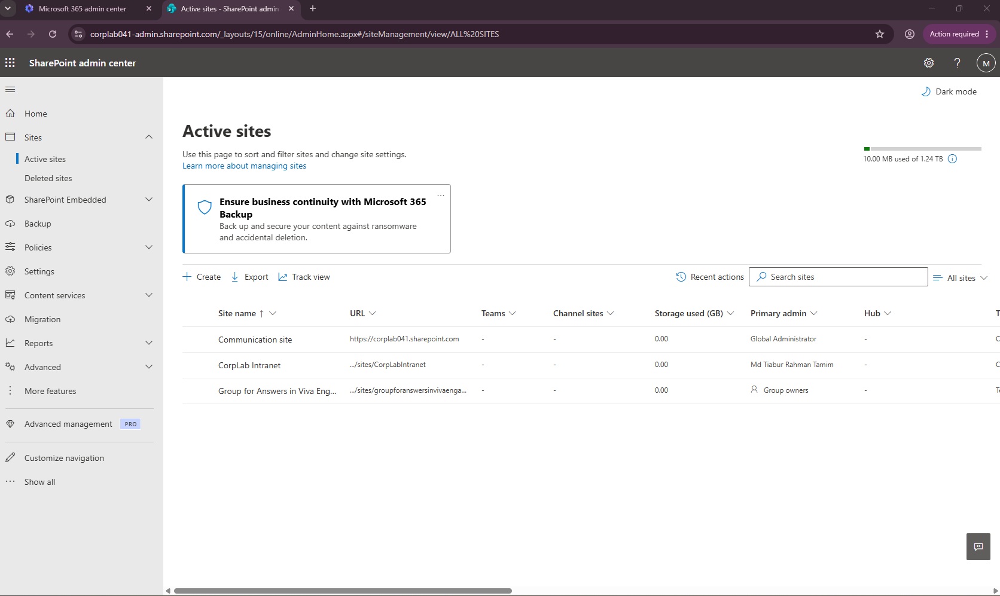

*SharePoint Admin Center Active sites showing the CorpLab Intranet site successfully created with Md Tiabur Rahman Tamim as primary owner.*

---

### Step 3 — Registering the CorpLab Intranet as a Hub Site

Creating a site is not enough — it needs to be **registered as a Hub Site** in the SharePoint Admin Center. This special designation gives the site hub powers: the ability to associate other sites and share navigation across them.

The CorpLab Intranet site was selected and registered as a Hub Site with the Hub name set to **CorpLab GmbH**. The green "Saved Successfully" banner confirmed the hub was registered correctly.

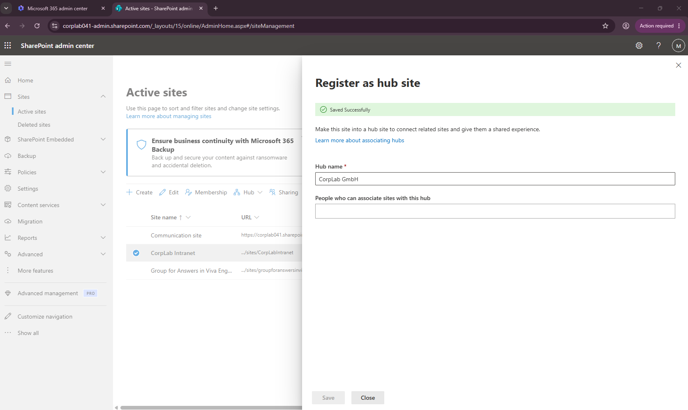

*"Register as hub site" panel showing Hub name "CorpLab GmbH" with the green "Saved Successfully" confirmation banner.*

---

### Step 4 — Creating the IT Department Site

With the hub registered, the first department site was created: **IT Department** at `/sites/ITDepartment`. This site would serve as the central space for the IT team to store technical documentation, security policies, and procedures.

After creation, the Active sites list confirmed the IT Department site appeared alongside the CorpLab Intranet hub — with the Hub column already showing "CorpLab GmbH (Hub site)" for the intranet.

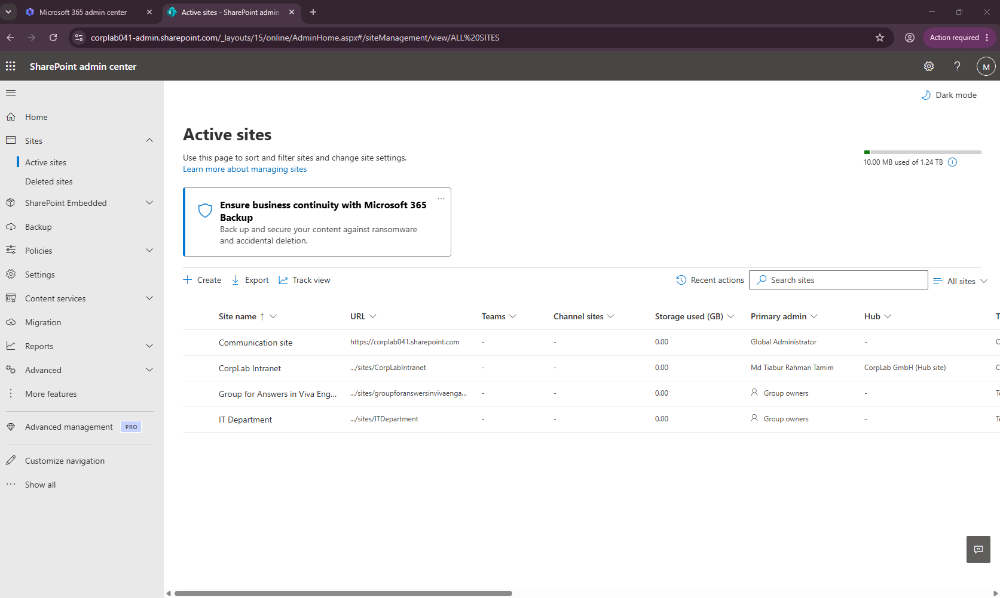

*SharePoint Admin Center Active sites showing the IT Department site at /sites/ITDepartment alongside the CorpLab Intranet hub.*

---

### Step 5 — Connecting IT Department Site to the Hub

The IT Department site was connected to the **CorpLab GmbH hub**. The "Edit hub association" panel was opened, the hub "CorpLab GmbH" was selected from the dropdown, and the green "Changes saved" banner confirmed the association was successful.

This connection means the IT Department site now inherits the hub's shared navigation and appears in hub-wide searches.


*"Edit hub association" panel showing "CorpLab GmbH" selected with the green "Changes saved" confirmation — IT Department is now connected to the hub.*

---

### Step 6 — Creating the HR Department Site

The second department site was created for the **HR Department** at `/sites/HRDepartment`. This site would house employee handbooks, onboarding documents, and HR recruitment policies.

The Active sites list confirmed the HR Department site was created, and the Hub column already showed "CorpLab GmbH" — confirming it was connected to the hub at creation.

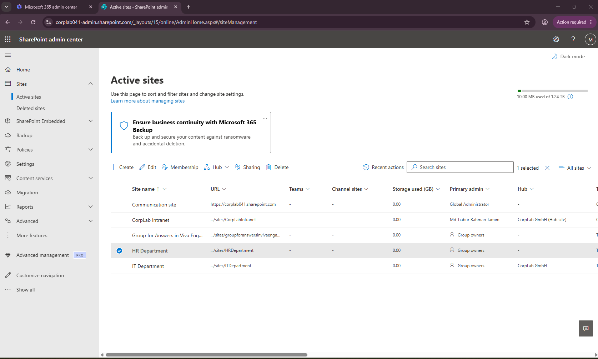

*SharePoint Admin Center showing the HR Department site at /sites/HRDepartment — with IT Department already showing "CorpLab GmbH" in the Hub column.*

---

### Step 7 — Connecting HR Department Site to the Hub

The HR Department site was associated with the **CorpLab GmbH hub** using the same "Edit hub association" panel. The green "Changes saved" banner confirmed the association was complete.

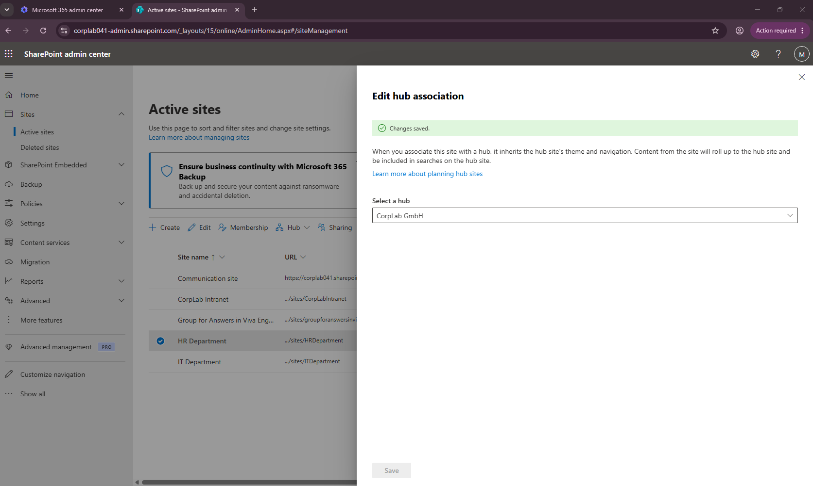

*"Edit hub association" panel showing HR Department (selected, blue checkmark) now associated with "CorpLab GmbH" hub.*

---

### Step 8 — Creating the Finance Department Site

The third and final department site was created for the **Finance Department** at `/sites/FinanceDepartment`. Financial reports, budget policies, and expense procedures would be stored here.

The Active sites list now showed all three department sites — IT Department and HR Department both showing "CorpLab GmbH" in the Hub column, with Finance Department freshly selected.


*SharePoint Admin Center showing all five sites — CorpLab Intranet as hub, Finance Department (selected), HR Department, and IT Department all visible.*

---

### Step 9 — All Sites Connected to the Hub

With all three department sites created and connected, the **Active sites overview** showed the complete intranet architecture. Every department site displayed "CorpLab GmbH" in the Hub column, confirming the hub-and-spoke architecture was fully operational.

| Site | URL | Hub |
|---|---|---|
| CorpLab Intranet | /sites/CorpLabIntranet | CorpLab GmbH (Hub site) |
| IT Department | /sites/ITDepartment | CorpLab GmbH |
| HR Department | /sites/HRDepartment | CorpLab GmbH |
| Finance Department | /sites/FinanceDepartment | CorpLab GmbH |

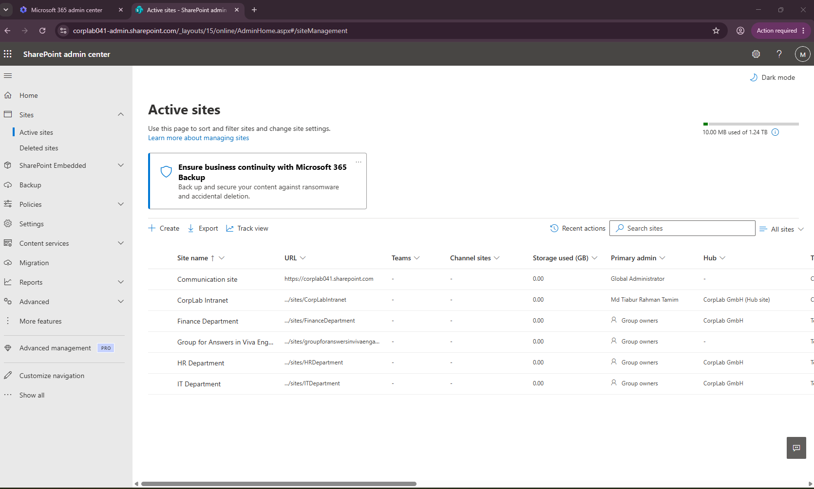

*SharePoint Admin Center Active sites showing all four project sites — CorpLab Intranet as hub and all three department sites connected with "CorpLab GmbH" in the Hub column.*

---

### Step 10 — IT Department Site with Document Library

The IT Department site was opened in SharePoint. The site showed the team site home page with the **CorpLab GmbH** hub navigation at the top — confirming the hub connection is active. The left navigation already displayed the **Policies & Procedures** document library alongside the default site navigation links.

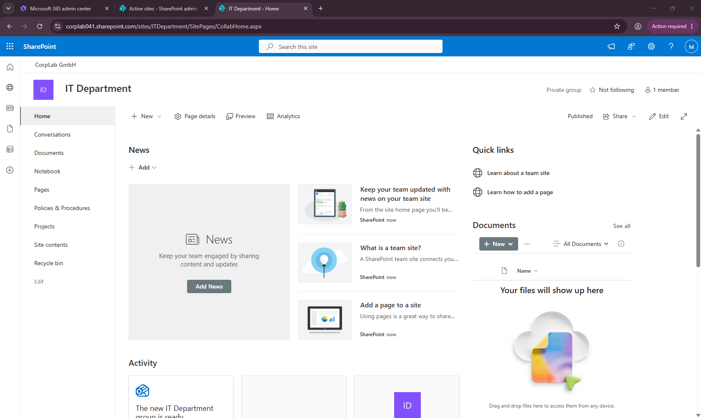

*IT Department SharePoint site showing the CorpLab GmbH hub navigation at top and Policies & Procedures document library in the left navigation.*

---

### Step 11 — Documents Uploaded to IT Department Library

Three real IT documents were uploaded to the **Policies & Procedures** document library on the IT Department site:

- **IT_Project_Plan.docx** — uploaded a few seconds ago
- **IT_Security_Policy.docx** — uploaded 7 minutes ago
- **Network_Procedures.docx** — uploaded 3 minutes ago

All documents were uploaded by Md Tiabur Rahman Tamim and are stored with full version history in SharePoint.

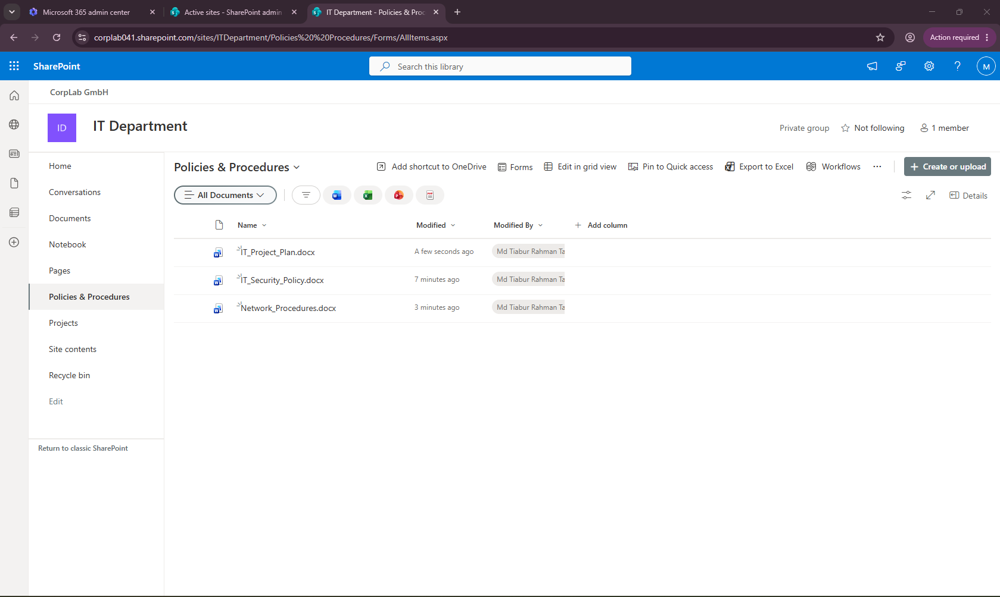

*IT Department — Policies & Procedures library showing three IT documents successfully uploaded with timestamps and Modified By confirmation.*

---

### Step 12 — HR Department Document Library with Files

The HR Department Policies & Procedures document library was populated with three HR documents:

- **Employee_Handbook.docx**
- **HR_Onboarding_Procedures.docx**
- **HR_Recruitment_Policy.docx**

The library URL confirms the correct SharePoint site path: `/sites/HRDepartment/Policies%20Procedures/`.

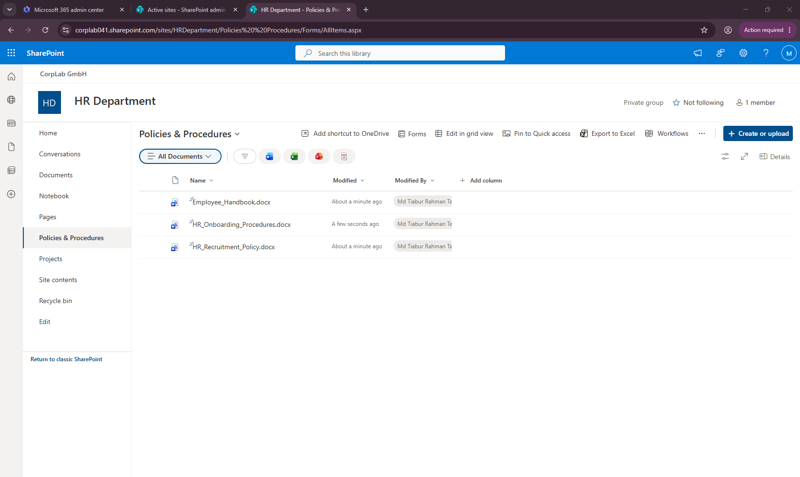

*HR Department — Policies & Procedures library showing three HR documents successfully stored in the HR Department SharePoint site.*

---

### Step 13 — Finance Department Document Library with Files

The Finance Department Policies & Procedures document library was populated with three Finance documents:

- **Expense_Procedures.docx**
- **Finance_Budget_Policy.docx**
- **Finance_Report_2026.docx**

The library URL confirms the correct SharePoint path: `/sites/FinanceDepartment/`.

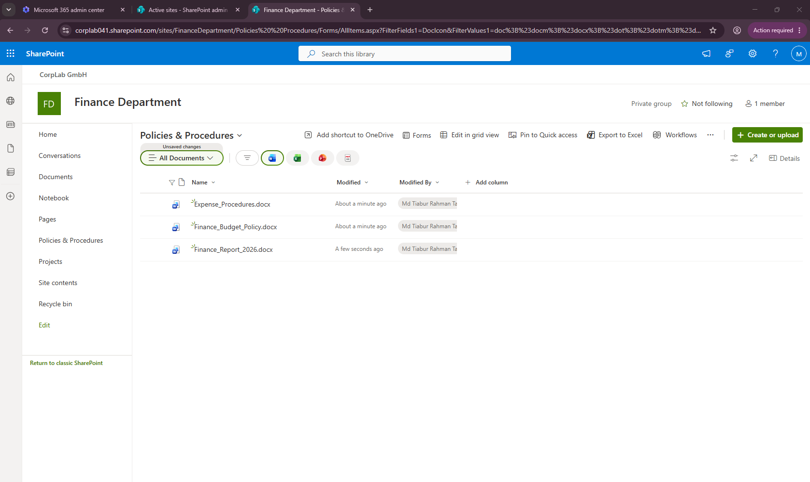

*Finance Department — Policies & Procedures library showing three Finance documents stored in the Finance Department SharePoint site.*

---

### Step 14 — IT Department Site Permissions

Permissions were configured on the IT Department site using SharePoint's built-in permission management. The permissions page confirmed the correct structure:

| Permission Group | Type | Access Level |
|---|---|---|
| IT Department Members | SharePoint Group | Edit |
| IT Department Owners | SharePoint Group | Full Control |
| IT Department Visitors | SharePoint Group | Read |

The site also showed "Shared with: IT-Team" in the top right corner — confirming the Microsoft Entra ID IT-Team security group has access to this site.


*IT Department Permissions page showing Members (Edit), Owners (Full Control), and Visitors (Read) groups with "Shared with: IT-Team" confirmation.*

---

### Step 15 — HR Department Site Permissions

The HR Department site permissions were configured with the same professional permission structure, additionally including **Hub Visitors** with Read access — allowing hub-level navigation without granting department-level edit rights.

| Permission Group | Type | Access Level |
|---|---|---|
| HR Department Members | SharePoint Group | Edit |
| HR Department Owners | SharePoint Group | Full Control |
| HR Department Visitors | SharePoint Group | Read |
| Hub Visitors | SharePoint Group | Read |

The "Shared with: HR-Team" confirmation appeared in the top right corner.

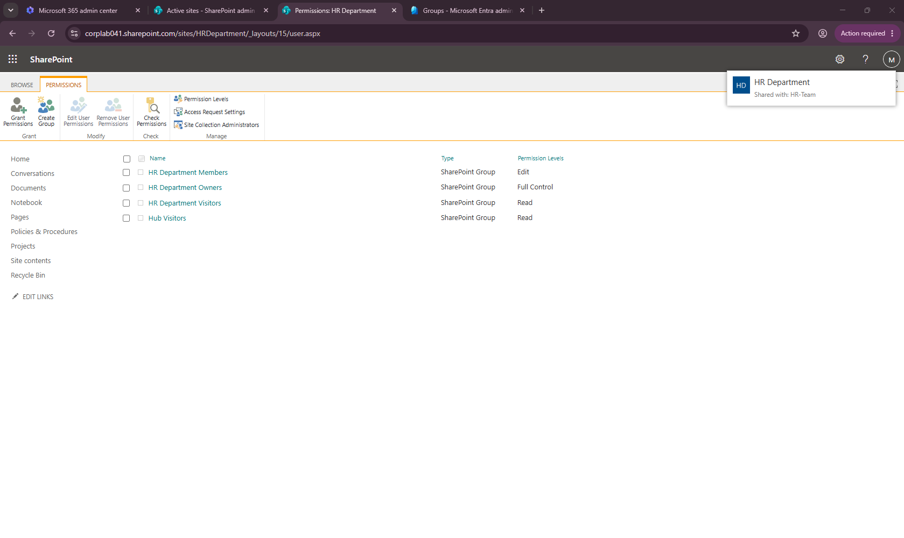

*HR Department Permissions page showing the four permission groups with "Shared with: HR-Team" — confirming Entra ID group access.*

---

### Step 16 — Finance Department Site Permissions

The Finance Department site permissions followed the same enterprise-grade structure, with Hub Visitors included at Read level to support hub-wide navigation while keeping financial documents restricted to Finance team members only.

| Permission Group | Type | Access Level |
|---|---|---|
| Finance Department Members | SharePoint Group | Edit |
| Finance Department Owners | SharePoint Group | Full Control |
| Finance Department Visitors | SharePoint Group | Read |
| Hub Visitors | SharePoint Group | Read |

The "Shared with: Finance-Team" confirmation appeared in the top right corner.

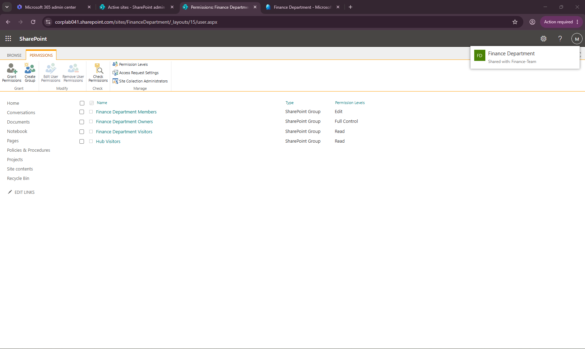

*Finance Department Permissions page with all four groups confirmed and "Shared with: Finance-Team" — ensuring Finance documents are only editable by Finance team members.*

---

## Phase 2 — Power Automate Workflows

With the SharePoint intranet fully built and permissions configured, it was time to automate business processes. **Power Automate** connects Microsoft 365 services and triggers automated actions based on events — saving time, reducing manual work, and enforcing consistent processes.

Two automated cloud flows were built and proven to work with real test runs.

---

### Step 17 — Power Automate Home

Power Automate was accessed at make.powerautomate.com. The home page greeted the admin: **"Hello, Md Tiabur Rahman"** with the **CorpLab (default)** environment confirmed in the top right corner — the same environment where the SharePoint sites were created.

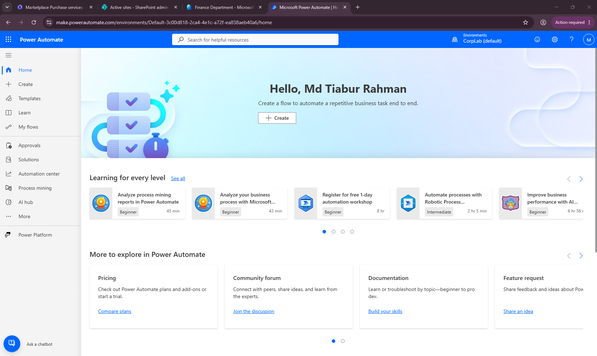

*Power Automate home page showing the personalised greeting for Md Tiabur Rahman and the CorpLab (default) environment in the top right.*

---

## Flow 1 — External Sharing Alert and Approval

**Business Problem:** When staff upload files to the IT Department SharePoint, there is no control process. Anyone can upload anything without review or approval from the IT administrator.

**Solution:** An automated approval workflow that triggers whenever a new file is added to the SharePoint document library, sends an approval request to the admin, waits for a response, then sends a confirmation email based on the decision.

**Flow Logic:**
```
When an item is created (SharePoint — IT Department)
    ↓
Start and wait for an approval (Approve/Reject)
    ↓
Condition: Outcome = "Approve"?
    ├── TRUE → Send email: "File Upload Approved ✅"
    └── FALSE → Send email: "File Upload Rejected ❌"
```

---

### Step 18 — Flow 1 Trigger Configured

The flow was created as an **Automated Cloud Flow** named "External Sharing Alert and Approval". The trigger was set to **"When an item is created"** from SharePoint, connected to:

- **Site Address:** IT Department — https://corplab041.sharepoint.com/sites/ITDepartment
- **List Name:** Policies & Procedures

This means: every time a new file is added to that document library, the approval process starts automatically.

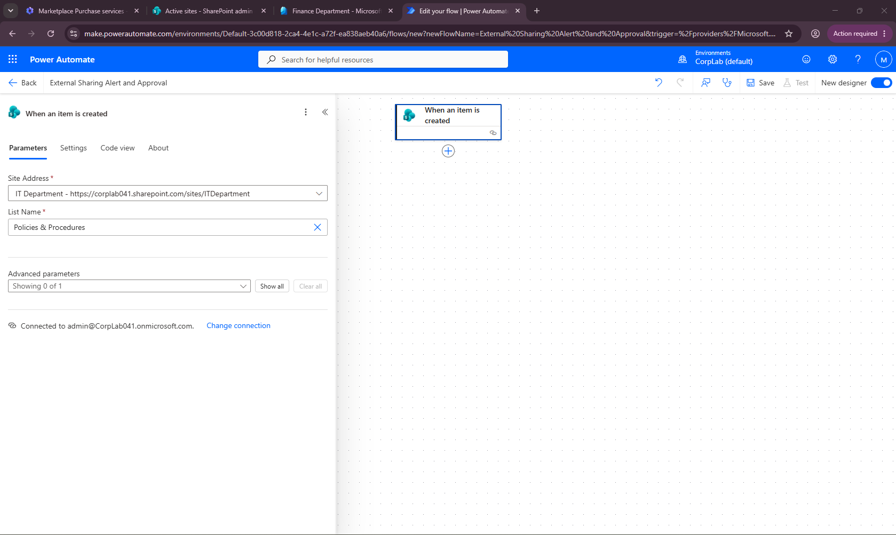

*Power Automate flow editor showing the SharePoint "When an item is created" trigger configured for the IT Department site — Policies & Procedures library, connected to admin@CorpLab041.onmicrosoft.com.*

---

### Step 19 — Approval Step Configured

An **approval action** was added: "Start and wait for an approval". The configuration was:

- **Approval type:** Approve/Reject — First to respond
- **Title:** New File Approval Request
- **Assigned to:** Md Tiabur Rahman Tamim (admin@CorpLab041.onmicrosoft.com)

This step pauses the entire flow and waits for a human decision before any email is sent. This is the core of the approval process — the flow will not proceed until the admin responds.

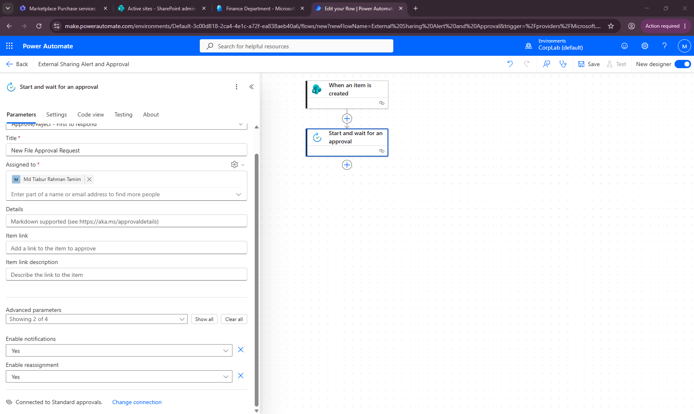

*Approval action showing "Approve/Reject - First to respond" type, title "New File Approval Request", and assigned to Md Tiabur Rahman Tamim.*

---

### Step 20 — Complete Flow 1 Diagram

The complete flow was built with all five steps visible on the canvas:

1. **When an item is created** — SharePoint trigger
2. **Start and wait for an approval** — sends approval request to admin
3. **Condition** — checks if the outcome equals "Approve"
4. **True branch** — sends "File Upload Approved" email
5. **False branch** — sends "File Upload Rejected" email

This is a professional approval workflow pattern used widely in enterprise Microsoft 365 environments.

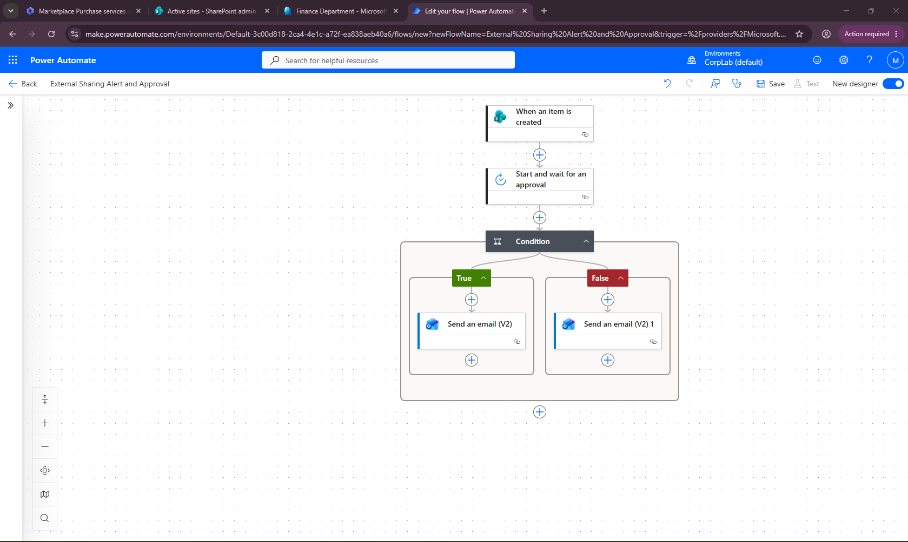

*Complete flow diagram showing all five steps: trigger → approval → condition → two email branches (True/False).*

---

### Step 21 — Flow 1 Running Live

The flow was tested by uploading a document named **Test_Approval_Doc.docx** to the IT Department Policies & Procedures library. The flow triggered automatically within seconds.

The run view showed:

- ✅ **"When an item is created"** — completed in 0.3 seconds (green tick)
- 🔄 **"Start and wait for an approval"** — spinning (waiting for admin response)
- ⏳ **Condition + email branches** — queued, waiting for approval outcome

The banner at the top confirmed: **"Your flow is running..."**

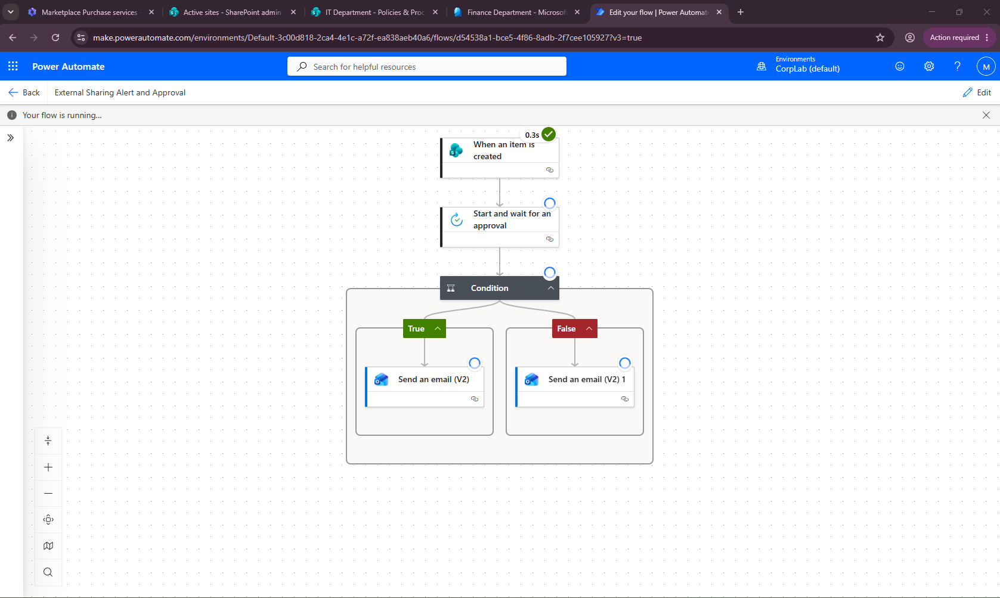

*Flow run view showing "Your flow is running..." banner with green checkmark on the trigger step (0.3s) and the approval step waiting for a human response.*

---

### Step 21b — Approval Request Received in Power Automate

The Power Automate **Approvals** inbox showed the pending request:

- **Request:** New File Approval Request
- **Received:** Jun 21, 03:18 PM (6 min ago)
- **Requested by:** Md Tiabur Rahman Tamim

This confirms the approval step worked correctly and sent the request to the approvals queue.

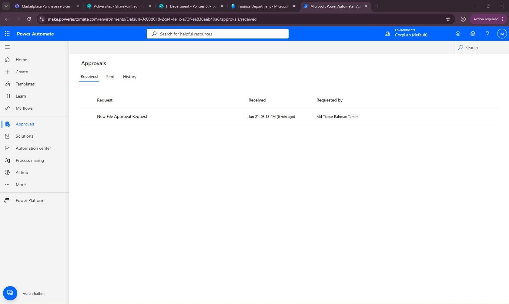

*Power Automate Approvals page showing the pending "New File Approval Request" received at Jun 21, 03:18 PM, requested by Md Tiabur Rahman Tamim.*

---

### Step 21c — Approval Confirmed

The approval request was opened and approved. The "Respond: Approve" panel displayed the green confirmation:

**"Response successfully recorded"**

The approval request disappeared from the pending list, confirming the response was sent back to the flow to continue processing.

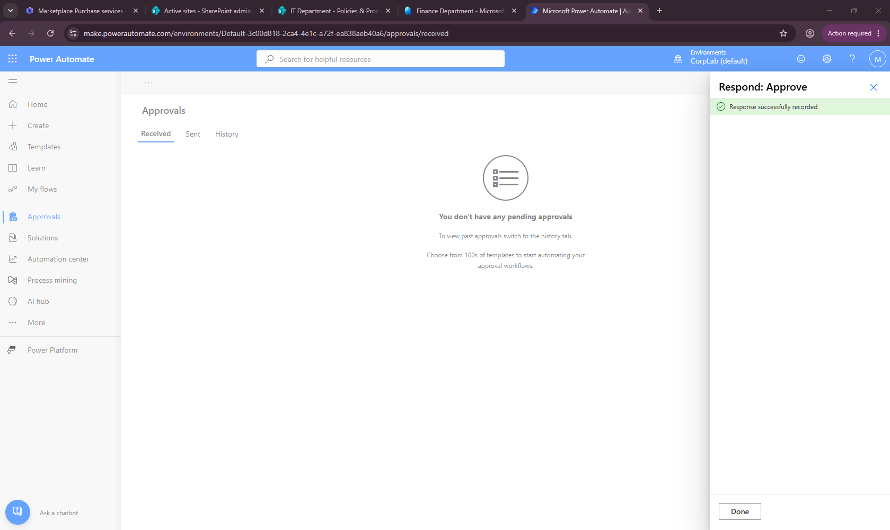

*"Respond: Approve" panel showing the green "Response successfully recorded" confirmation — the approval has been processed and the flow will continue.*

---

### Step 21d — Flow 1 Succeeded

The 28-day run history for the "External Sharing Alert and Approval" flow confirmed the complete end-to-end run:

- **Flow:** External Sharing Alert and Approval
- **Status:** On
- **Run start:** Jun 21, 03:13 PM
- **Duration:** 00:13:23 (13 minutes — the time taken to review and approve)
- **Status:** ✅ **Succeeded**

The average run duration of 00:13:23 reflects real-world approval time — a human reviewed and approved the request, then the email was sent automatically.

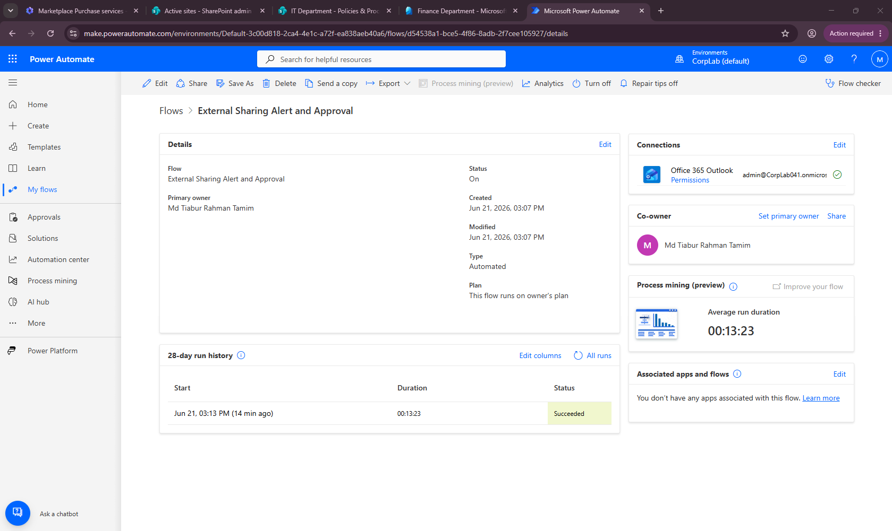

*Flow details page showing "External Sharing Alert and Approval" with Status: On and the 28-day run history entry: Jun 21, 03:13 PM — 00:13:23 — Succeeded.*

---

## Flow 2 — New Employee Welcome Email

**Business Problem:** When a new employee joins CorpLab, there is no automated welcome process. The IT team manually sends welcome emails — an inconsistent and time-consuming task.

**Solution:** An automated flow that triggers when a new email notification arrives in the admin inbox and automatically sends a professional welcome email with SharePoint intranet access details.

**Flow Logic:**
```
When a new email arrives (V3) — Office 365 Outlook
    ↓
Send an email (V2) — Welcome to CorpLab - Your Account is Ready!
```

---

### Step 22 — Flow 2 Email Action Configured

The second flow was created named **"New Employee Welcome Email"** with the trigger **"When a new email arrives (V3)"** connected to Office 365 Outlook.

The send email action was fully configured:

- **To:** Md Tiabur Rahman Tamim (admin@CorpLab041.onmicrosoft.com)
- **Subject:** Welcome to CorpLab - Your Account is Ready!
- **Body:** Professional welcome message including:
  - A personalised welcome greeting
  - SharePoint intranet URL: https://corplab041.sharepoint.com
  - IT Support contact: admin@CorpLab041.onmicrosoft.com
  - Sign-off from IT Department - CorpLab

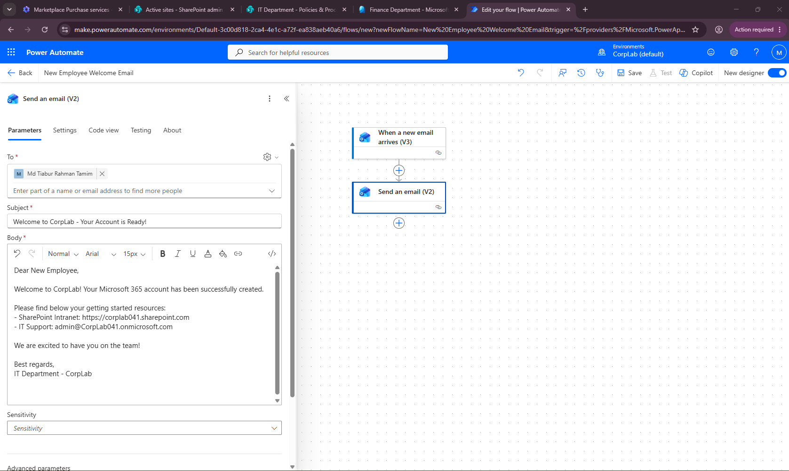

*Flow 2 "Send an email (V2)" action showing the complete professional welcome email — To, Subject, and full Body content all configured.*

---

### Step 23 — Flow 2 Successfully Ran

The flow was triggered by sending a test email to the admin inbox. The flow ran automatically and completed both steps in under one second:

- ✅ **"When a new email arrives (V3)"** — completed in 0.2 seconds (green tick)
- ✅ **"Send an email (V2)"** — completed in 0.3 seconds (green tick)

The green banner at the top confirmed: **"Your flow ran successfully."**

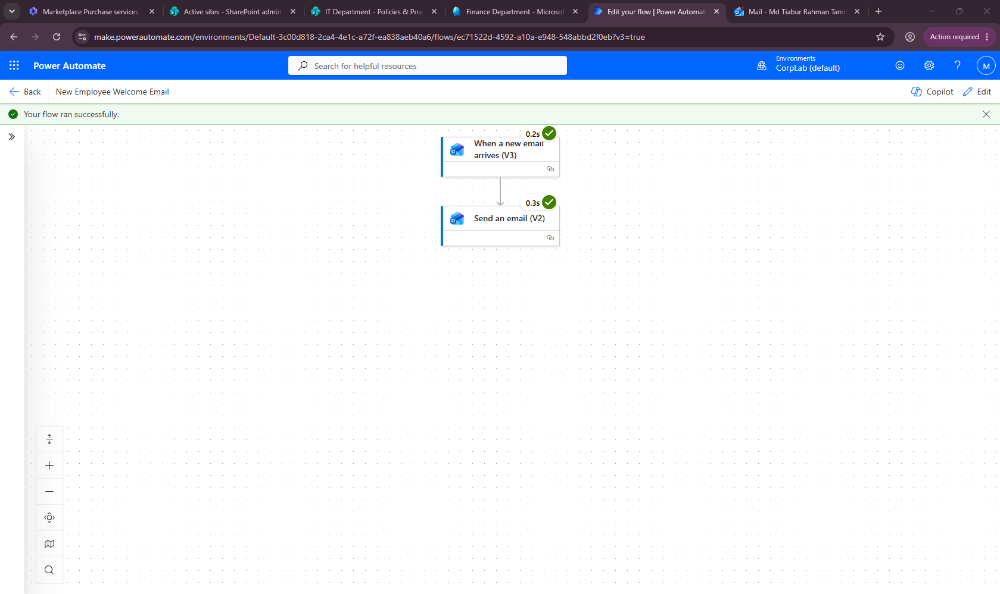

*Flow 2 run showing "Your flow ran successfully." banner with green checkmarks on both steps — trigger completed in 0.2s and email sent in 0.3s.*

---

### Step 24 — Welcome Email Received in Outlook

The Outlook inbox confirmed that the welcome email was delivered successfully. The email appeared with:

- **Subject:** Welcome to CorpLab - Your Account is Ready!
- **From:** Md Tiabur Rahman Tamim
- **Content:** Full professional welcome message visible in the reading pane

The email content showed exactly what was configured in the flow:
- "Dear New Employee, Welcome to CorpLab! Your Microsoft 365 account has been successfully created."
- SharePoint intranet link
- IT Support contact details
- "We are excited to have you on the team!"
- Sign-off: IT Department - CorpLab

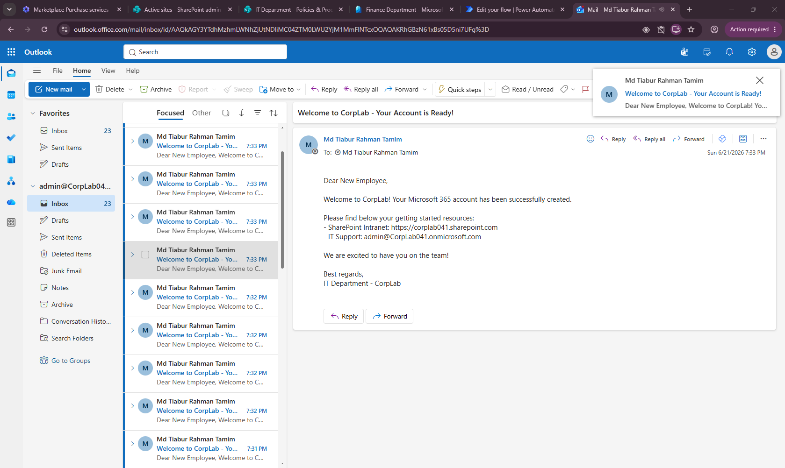

*Outlook inbox showing the automatically sent "Welcome to CorpLab - Your Account is Ready!" email with the full professional welcome message visible in the reading pane.*

---

### Step 25 — Flow 2 Run History — Multiple Succeeded Runs

The 28-day run history for the "New Employee Welcome Email" flow showed **multiple consecutive Succeeded runs** — confirming the flow is reliable, fast, and consistent:

| Run Start | Duration | Status |
|---|---|---|
| Jun 21, 07:34 PM (5 sec ago) | 177 ms | ✅ Succeeded |
| Jun 21, 07:34 PM (22 sec ago) | 165 ms | ✅ Succeeded |
| Jun 21, 07:34 PM (39 sec ago) | 181 ms | ✅ Succeeded |
| Jun 21, 07:33 PM (56 sec ago) | 168 ms | ✅ Succeeded |
| Jun 21, 07:33 PM (1 min ago) | 170 ms | ✅ Succeeded |
| Jun 21, 07:33 PM (1 min ago) | 180 ms | ✅ Succeeded |

All runs completed in under 200 milliseconds — demonstrating excellent flow performance.

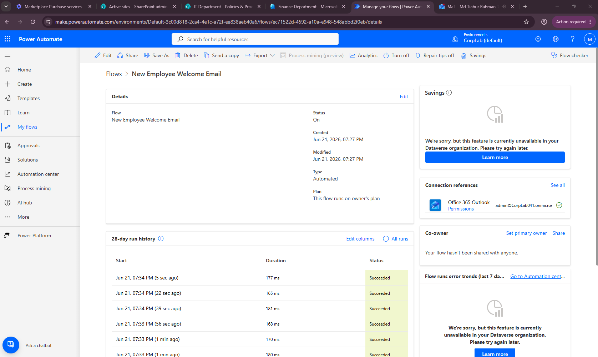

*New Employee Welcome Email flow — 28-day run history showing multiple consecutive Succeeded entries, all completing in 165–181ms.*

---

### Step 26 — All Flows Overview

The Power Automate **My flows** overview page confirmed both completed automated cloud flows are live in the CorpLab (default) environment:

| Flow Name | Modified | Type |
|---|---|---|
| New Employee Welcome Email | 19 min ago | Automated |
| External Sharing Alert and Approval | 4 h ago | Automated |

Both flows are of type **Automated** — meaning they run automatically based on triggers, with no manual intervention required.

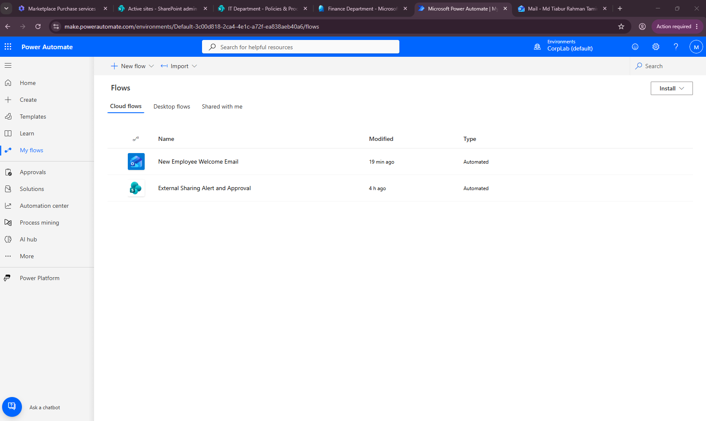

*Power Automate My flows page showing both completed automated cloud flows: "New Employee Welcome Email" and "External Sharing Alert and Approval" in the CorpLab (default) environment.*

---

## Final Results

| Component | Details | Status |
|---|---|---|
| SharePoint Hub Site | CorpLab Intranet — registered as "CorpLab GmbH" hub | ✅ Completed |
| IT Department Site | /sites/ITDepartment — connected to hub | ✅ Completed |
| HR Department Site | /sites/HRDepartment — connected to hub | ✅ Completed |
| Finance Department Site | /sites/FinanceDepartment — connected to hub | ✅ Completed |
| IT Document Library | Policies & Procedures — 3 IT documents uploaded | ✅ Completed |
| HR Document Library | Policies & Procedures — 3 HR documents uploaded | ✅ Completed |
| Finance Document Library | Policies & Procedures — 3 Finance documents uploaded | ✅ Completed |
| SharePoint Permissions | Members/Owners/Visitors + Hub Visitors per site | ✅ Completed |
| Entra ID Group Access | IT-Team, HR-Team, Finance-Team shared with sites | ✅ Completed |
| Flow 1 — File Approval | SharePoint trigger → Approval → Condition → Email — Succeeded | ✅ Completed |
| Flow 2 — Welcome Email | Email trigger → Welcome email sent — Multiple Succeeded | ✅ Completed |
| Flow Testing | Both flows tested live with real run history proof | ✅ Completed |

---

## Key Skills Demonstrated

- **SharePoint Hub Architecture** — designing a hub-and-spoke intranet with connected department sites
- **SharePoint Permission Management** — Members, Owners, Visitors, and Hub Visitors role configuration
- **Microsoft Entra ID Integration** — security group-based site access (IT-Team, HR-Team, Finance-Team)
- **Document Library Management** — creating and populating libraries with real departmental content
- **Power Automate — Approval Workflows** — multi-step flows with trigger, approval, condition, and branching email actions
- **Power Automate — Email Automation** — event-driven automated welcome email with professional content
- **Microsoft 365 Integration** — connecting SharePoint Online, Office 365 Outlook, and Power Automate in live workflows

---

## Certifications

- MS-900: Microsoft 365 Fundamentals
- MS-102: Microsoft 365 Administrator
- SC-300: Microsoft Identity and Access Administrator

---

## Related Projects

- [On-Premises Active Directory to Azure Entra ID Migration](https://github.com/Trtamim/OnPremises-ActiveDirectory-to-AzureEntra-Migration)

---

## Author

**Tiabur Rahman Tamim**
GitHub: [Trtamim](https://github.com/Trtamim)
